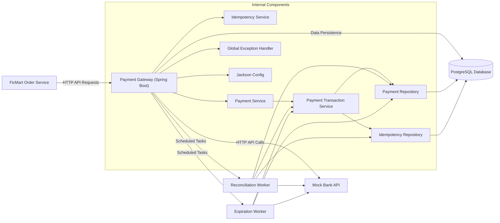
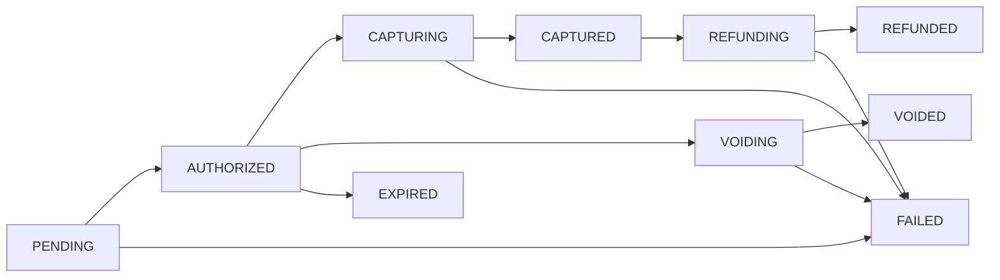

# FicMart Payment Gateway

This project acts as a robust payment gateway, sitting between FicMart's order service and a mock bank API. It's designed to reliably handle payment operations like authorization, capture, void, and refund, making sure everything stays consistent even when things go wrong, like duplicate requests, network issues with the bank, or application crashes. Essentially, it ensures FicMart's payment processes are smooth and dependable, so users don't have to worry about the complexities of dealing with various bank interactions directly.

## Features

This gateway isn't just a simple pass-through to the bank; it's got several built-in mechanisms to make payments reliable and safe:

*   **Payment Lifecycle Management**: It precisely tracks the state of each payment (e.g., `PENDING`, `AUTHORIZED`, `CAPTURED`, `REFUNDED`), ensuring that operations only happen when they make sense. For instance, you can't refund a payment that hasn't been captured yet.
*   **Idempotency**: Every payment operation is idempotent, meaning you can safely retry a request without worrying about accidental duplicate charges or unintended side effects. It remembers previous requests and returns the original result if you send the same one again.
    ```mermaid
    sequenceDiagram
      actor FicMart
      participant Gateway
      participant IdempotencyService as "Idempotency Service"
      participant PaymentTransactionService as "Payment Transaction Service"
      participant BankAPI as "Mock Bank API"
      participant DB as PostgreSQL

      FicMart->>Gateway: POST /payments/authorize (Idempotency-Key: K1, Request: R1)
      activate Gateway
      Gateway->>IdempotencyService: checkAndReplay(K1, hash(R1))
      activate IdempotencyService
      alt Idempotency Key not found
        IdempotencyService-->>Gateway: null
        deactivate IdempotencyService
        Gateway->>PaymentTransactionService: authorizePhaseOne(...)
        activate PaymentTransactionService
        PaymentTransactionService->>DB: INSERT Payment (PENDING), INSERT IdempotencyKey (lockedAt)
        PaymentTransactionService-->>Gateway: Payment (PENDING)
        deactivate PaymentTransactionService
        Gateway->>BankAPI: POST /api/v1/authorizations (Idempotency-Key: K1, Request: R1)
        activate BankAPI
        BankAPI-->>Gateway: BankAuthorizationResponse (Success)
        deactivate BankAPI
        Gateway->>PaymentTransactionService: authorizePhaseTwoSuccess(...)
        activate PaymentTransactionService
        PaymentTransactionService->>DB: UPDATE Payment (AUTHORIZED), UPDATE IdempotencyKey (unlock, store response)
        PaymentTransactionService-->>Gateway: Payment (AUTHORIZED)
        deactivate PaymentTransactionService
        Gateway-->>FicMart: ApiResponse<Payment> (Success)
      else Idempotency Key found, lockedAt is NULL, requestHash matches
        IdempotencyService-->>Gateway: Stored Payment (from responseBody)
        deactivate IdempotencyService
        Gateway-->>FicMart: ApiResponse<Payment> (Success - Replayed)
      else Idempotency Key found, lockedAt is NOT NULL
        IdempotencyService--xGateway: GatewayException (Request In Flight)
        deactivate IdempotencyService
        Gateway--xIdempotencyService: 409 Conflict
      else Idempotency Key found, requestHash mismatch
        IdempotencyService--xGateway: GatewayException (Key Mismatch)
        deactivate IdempotencyService
        Gateway--xIdempotencyService: 400 Bad Request
      end
      deactivate Gateway
    ```
*   **Atomic Two-Phase Transactions**: Each critical payment operation (authorize, capture, void, refund) is broken into two database transaction phases. The external bank call happens *between* these phases, preventing long-held database locks and improving system resilience against network failures or crashes. If the system crashes mid-operation, there's always a consistent record of intent.
*   **Crash Recovery with Reconciliation Workers**: Workers periodically scan for payments stuck in intermediate states (like `CAPTURING`, `VOIDING`, `REFUNDING`). If a payment is stuck, the worker automatically retries the bank operation and completes the transaction, ensuring that payments don't get lost or remain incomplete due to unexpected failures.
    ```mermaid
    flowchart TD
        Start((Start)) --> ReconciliationWorker
        ReconciliationWorker["ReconciliationWorker (Scheduled)"] --> FindStuckPayments["Find payments in CAPTURING, VOIDING, REFUNDING statuses"]
        FindStuckPayments --> LoopPayments{For each Stuck Payment}
        LoopPayments --> RecoverPayment[Recover Payment]
        RecoverPayment --> IdentifyOperation{Identify intended operation (Capture/Void/Refund)}
        IdentifyOperation --> FetchIdempotencyKey["Fetch IdempotencyKey from DB"]
        FetchIdempotencyKey --> RetryBankCall["Retry Bank API call with IdempotencyKey"]
        RetryBankCall --> HandleBankResponse{Bank Response?}
        HandleBankResponse -- Success --> PhaseTwoSuccess["Payment Transaction Service: Phase Two Success (DB Update, Idempotency Unlock)"]
        HandleBankResponse -- Failure --> LogError["Log Error (Bank Failure)"]
        PhaseTwoSuccess --> EndLoop
        LogError --> EndLoop
        EndLoop --> LoopPayments
        LoopPayments -- No more stuck payments --> End((End))
    ```
*   **Authorization Expiration Worker**: A dedicated worker checks for authorized payments nearing or past their expiration time. It verifies with the bank if the authorization is still valid and marks the payment as `EXPIRED` if confirmed, cleaning up old authorizations and maintaining accurate payment states.
*   **Robust Error Handling & Retries**: Bank errors are intelligently categorized. Transient errors (like 5xx HTTP codes) are retried with exponential backoff and jitter to prevent overwhelming the bank. Permanent errors (like 4xx HTTP codes) fail fast to provide immediate feedback.

## System Architecture / Design

The payment gateway is a Spring Boot application designed to be a central point for payment processing within the FicMart ecosystem. It communicates with FicMart's order service (as a client) and an external mock bank API, using PostgreSQL for persistent storage and idempotency management.



## Running Locally

To get this payment gateway up and running on your local machine, follow these steps:

**Prerequisites:**

*   Java 21
*   Maven
*   Docker

**Steps:**

1.  **Clone the Repository:**

    ```bash
    git clone https://github.com/DanielPopoola/payment-gateway.git
    cd payment-gateway
    ```

2.  **Set up the Mock Bank API:**

    This project uses a separate mock bank API. You'll need to clone it from its own repository and start it.

    ```bash
    git clone https://github.com/benx421/payment-gateway # This is the mock bank repo, not this project itself!
    cd payment-gateway # Navigate into the *mock bank* repo
    make up
    # The bank API should now be running on http://localhost:8787
    ```

3.  **Start PostgreSQL:**

    The gateway uses PostgreSQL for its database. You can start it easily with Docker Compose:

    ```bash
    docker compose up -d
    # This will start a PostgreSQL container on port 5433 (as configured in application.yml)
    ```

4.  **Configure Environment Variables (Optional, defaults are provided):**

    The `application.yml` file uses environment variables with sensible defaults. If you need to override them, you can create an `application-local.yml` or set them directly in your shell. For example, to use a different bank URL or database:

    ```yaml
    # Example config.example.yml for reference
    spring:
        datasource:
            url: jdbc:postgresql://localhost:5432/gateway # Default is 5433
            username: postgres
            password: changeme # Default is postgres

    bank:
        base-url: http://localhost:8787
        retry:
            max-attempts: 3
            base-delay-ms: 200
        timeout:
            connect-ms: 3000
            read-ms: 5000
    ```

5.  **Run the Gateway Application:**

    Once the bank and PostgreSQL are running, you can start the Spring Boot gateway:

    ```bash
    mvn spring-boot:run
    ```

    The gateway will be available at `http://localhost:8080`.

## Usage

The FicMart Payment Gateway exposes a RESTful API for handling payment transactions. All `POST` endpoints require an `Idempotency-Key` header to ensure safe retries.

Swagger UI is available at `http://localhost:8080/swagger-ui.html` when running locally, providing interactive documentation for all endpoints.

### Response Envelope

All API responses follow a consistent envelope structure:

**Success Response:**
```json
{
  "success": true,
  "message": "OK",
  "data": {
    "id": "a1b2c3d4-e5f6-7890-1234-567890abcdef",
    "order_id": "FicMart-Order-123",
    "customer_id": 12345,
    "amount_cents": 10000,
    "currency": "USD",
    "status": "AUTHORIZED",
    "bank_auth_id": "bank_auth_xyz123",
    "bank_capture_id": null,
    "bank_void_id": null,
    "bank_refund_id": null,
    "created_at": "2023-10-26T10:00:00Z",
    "updated_at": "2023-10-26T10:01:00Z",
    "authorized_at": "2023-10-26T10:01:00Z",
    "captured_at": null,
    "voided_at": null,
    "refunded_at": null,
    "expires_at": "2023-11-26T10:01:00Z",
    "expired_at": null,
    "failed_at": null
  }
}
```

**Error Response:**
```json
{
  "success": false,
  "message": "Validation failed",
  "error": {
    "code": "validation_error",
    "details": [
      "cardNumber: must not be null"
    ]
  }
}
```

### API Endpoints

#### `POST /payments/authorize`
**Description**: Initiates a payment authorization, reserving funds on a customer's card. This is the first step in a payment flow.

**Authentication**: `Idempotency-Key` header (UUID) is required.

**Request**:
```json
{
  "cardNumber": "4111111111111111",
  "cvv": "123",
  "expiryMonth": 12,
  "expiryYear": 2025,
  "amountCents": 10000,
  "orderId": "FicMart-Order-123",
  "customerId": 12345
}
```

**Response**:
```json
{
  "success": true,
  "message": "OK",
  "data": {
    "id": "a1b2c3d4-e5f6-7890-1234-567890abcdef",
    "order_id": "FicMart-Order-123",
    "customer_id": 12345,
    "amount_cents": 10000,
    "currency": "USD",
    "status": "AUTHORIZED",
    "bank_auth_id": "bank_auth_xyz123",
    "expires_at": "2023-11-26T10:01:00Z",
    "created_at": "2023-10-26T10:00:00Z",
    "updated_at": "2023-10-26T10:01:00Z",
    "authorized_at": "2023-10-26T10:01:00Z"
    // ... other fields set to null or default
  }
}
```

**Errors**:
*   `400 Bad Request`: `validation_error` (e.g., missing required fields, invalid card details). `idempotency_key_mismatch` if `Idempotency-Key` is reused with a different payload.
*   `409 Conflict`: `request_in_flight` if the same `Idempotency-Key` is used for a request that's already being processed.
*   `500 Internal Server Error`: `internal_error` for unexpected server issues or bank 5xx errors after retries.

#### `POST /payments/{id}/capture`
**Description**: Captures a previously authorized payment, transferring the reserved funds from the customer to FicMart.

**Authentication**: `Idempotency-Key` header (UUID) is required.

**Request**: (No body required, payment ID is in path)
```json
{}
```

**Response**:
```json
{
  "success": true,
  "message": "OK",
  "data": {
    "id": "a1b2c3d4-e5f6-7890-1234-567890abcdef",
    "status": "CAPTURED",
    "bank_capture_id": "bank_capture_abc456",
    "captured_at": "2023-10-26T10:05:00Z",
    "updated_at": "2023-10-26T10:05:00Z"
    // ... other payment details
  }
}
```

**Errors**:
*   `400 Bad Request`: `invalid_transition` if the payment is not in an `AUTHORIZED` state.
*   `404 Not Found`: `payment_not_found` if the `paymentId` does not exist.
*   `409 Conflict`: `request_in_flight` if the same `Idempotency-Key` is used for a request that's already being processed.
*   `500 Internal Server Error`: `internal_error` for unexpected server issues or bank 5xx errors after retries.

#### `POST /payments/{id}/void`
**Description**: Voids a previously authorized payment, releasing the reserved funds back to the customer. This can only be done on an authorized payment before it's captured.

**Authentication**: `Idempotency-Key` header (UUID) is required.

**Request**: (No body required, payment ID is in path)
```json
{}
```

**Response**:
```json
{
  "success": true,
  "message": "OK",
  "data": {
    "id": "a1b2c3d4-e5f6-7890-1234-567890abcdef",
    "status": "VOIDED",
    "bank_void_id": "bank_void_def789",
    "voided_at": "2023-10-26T10:10:00Z",
    "updated_at": "2023-10-26T10:10:00Z"
    // ... other payment details
  }
}
```

**Errors**:
*   `400 Bad Request`: `invalid_transition` if the payment is not in an `AUTHORIZED` state.
*   `404 Not Found`: `payment_not_found` if the `paymentId` does not exist.
*   `409 Conflict`: `request_in_flight` if the same `Idempotency-Key` is used for a request that's already being processed.
*   `500 Internal Server Error`: `internal_error` for unexpected server issues or bank 5xx errors after retries.

#### `POST /payments/{id}/refund`
**Description**: Refunds a captured payment, returning the funds to the customer. This can only be done on a captured payment.

**Authentication**: `Idempotency-Key` header (UUID) is required.

**Request**: (No body required, payment ID is in path)
```json
{}
```

**Response**:
```json
{
  "success": true,
  "message": "OK",
  "data": {
    "id": "a1b2c3d4-e5f6-7890-1234-567890abcdef",
    "status": "REFUNDED",
    "bank_refund_id": "bank_refund_ghi012",
    "refunded_at": "2023-10-26T10:15:00Z",
    "updated_at": "2023-10-26T10:15:00Z"
    // ... other payment details
  }
}
```

**Errors**:
*   `400 Bad Request`: `invalid_transition` if the payment is not in a `CAPTURED` state.
*   `404 Not Found`: `payment_not_found` if the `paymentId` does not exist.
*   `409 Conflict`: `request_in_flight` if the same `Idempotency-Key` is used for a request that's already being processed.
*   `500 Internal Server Error`: `internal_error` for unexpected server issues or bank 5xx errors after retries.

#### `GET /payments/{id}`
**Description**: Retrieves the details of a single payment by its unique gateway ID.

**Request**: (No body required, payment ID is in path)

**Response**:
```json
{
  "success": true,
  "message": "OK",
  "data": {
    "id": "a1b2c3d4-e5f6-7890-1234-567890abcdef",
    "order_id": "FicMart-Order-123",
    "customer_id": 12345,
    "amount_cents": 10000,
    "currency": "USD",
    "status": "AUTHORIZED",
    "bank_auth_id": "bank_auth_xyz123",
    "expires_at": "2023-11-26T10:01:00Z",
    "created_at": "2023-10-26T10:00:00Z",
    "updated_at": "2023-10-26T10:01:00Z",
    "authorized_at": "2023-10-26T10:01:00Z"
    // ... other payment details
  }
}
```

**Errors**:
*   `404 Not Found`: `payment_not_found` if the `paymentId` does not exist.

#### `GET /payments`
**Description**: Retrieves a list of payments. Requires either `order_id` or `customer_id` as a query parameter.

**Request**:
`GET /payments?order_id=FicMart-Order-123`
OR
`GET /payments?customer_id=12345`

**Response (for `order_id`)**:
```json
{
  "success": true,
  "message": "OK",
  "data": [
    {
      "id": "a1b2c3d4-e5f6-7890-1234-567890abcdef",
      "order_id": "FicMart-Order-123",
      "customer_id": 12345,
      "amount_cents": 10000,
      "currency": "USD",
      "status": "AUTHORIZED",
      // ... other payment details
    }
  ]
}
```

**Response (for `customer_id`)**:
```json
{
  "success": true,
  "message": "OK",
  "data": [
    {
      "id": "b2c3d4e5-f678-9012-3456-7890abcdef01",
      "order_id": "FicMart-Order-456",
      "customer_id": 12345,
      "amount_cents": 2500,
      "currency": "USD",
      "status": "CAPTURED",
      // ... other payment details
    },
    // ... potentially more payments for the same customer
  ]
}
```

**Errors**:
*   `400 Bad Request`: `missing_query_param` if neither `order_id` nor `customer_id` is provided.

#### `GET /payments/{id}/events`
**Description**: Retrieves an audit log of all events associated with a specific payment, ordered chronologically.

**Request**: (No body required, payment ID is in path)

**Response**:
```json
{
  "success": true,
  "message": "OK",
  "data": [
    {
      "id": 1,
      "payment_id": "a1b2c3d4-e5f6-7890-1234-567890abcdef",
      "idempotency_key": "k1l2m3n4-o5p6-7890-1234-567890uvwxyz",
      "event_type": "AUTHORIZATION_REQUESTED",
      "detail": null,
      "created_at": "2023-10-26T10:00:00Z"
    },
    {
      "id": 2,
      "payment_id": "a1b2c3d4-e5f6-7890-1234-567890abcdef",
      "idempotency_key": "k1l2m3n4-o5p6-7890-1234-567890uvwxyz",
      "event_type": "AUTHORIZATION_SUCCEEDED",
      "detail": null,
      "created_at": "2023-10-26T10:01:00Z"
    },
    {
      "id": 3,
      "payment_id": "a1b2c3d4-e5f6-7890-1234-567890abcdef",
      "idempotency_key": "x1y2z3a4-b5c6-7890-1234-567890defghi",
      "event_type": "CAPTURE_REQUESTED",
      "detail": null,
      "created_at": "2023-10-26T10:04:00Z"
    },
    {
      "id": 4,
      "payment_id": "a1b2c3d4-e5f6-7890-1234-567890abcdef",
      "idempotency_key": "x1y2z3a4-b5c6-7890-1234-567890defghi",
      "event_type": "CAPTURE_SUCCEEDED",
      "detail": null,
      "created_at": "2023-10-26T10:05:00Z"
    }
  ]
}
```

**Errors**:
*   `404 Not Found`: `payment_not_found` if the `paymentId` does not exist.

#### `GET /health`
**Description**: A simple health check endpoint to confirm the service is running.

**Request**:
(No body required)

**Response**:
```json
{
  "success": true,
  "message": "OK",
  "data": {
    "status": "healthy"
  }
}
```

**Errors**:
*   `500 Internal Server Error`: `internal_error` if the application is not healthy.

### Environment Variables

The application can be configured using the following environment variables. Sensible defaults are provided in `application.yml` and `config.example.yml`.

| Variable                        | Description                                          | Default Value         | Example Value        |
| :------------------------------ | :--------------------------------------------------- | :-------------------- | :------------------- |
| `DB_URL`                        | PostgreSQL database connection URL                   | `jdbc:postgresql://localhost:5433/gateway` | `jdbc:postgresql://my-db:5432/my-gateway-db` |
| `DB_USERNAME`                   | PostgreSQL database username                         | `postgres`            | `myuser`             |
| `DB_PASSWORD`                   | PostgreSQL database password                         | `postgres`            | `mypassword`         |
| `BANK_BASE_URL`                 | Base URL for the mock bank API                       | `http://localhost:8787` | `http://mock-bank-service:8787` |
| `BANK_RETRY_MAX_ATTEMPTS`       | Maximum number of retry attempts for bank calls      | `3`                   | `5`                  |
| `BANK_RETRY_BASE_DELAY_MS`      | Base delay in milliseconds for bank call retries     | `200`                 | `500`                |
| `BANK_CONNECT_TIMEOUT_MS`       | Connection timeout for bank API calls in milliseconds | `3000`                | `2000`               |
| `BANK_READ_TIMEOUT_MS`          | Read timeout for bank API calls in milliseconds      | `5000`                | `10000`              |
| `RECONCILIATION_DELAY_MS`       | Delay between runs of the reconciliation worker in milliseconds | `60000` (1 minute) | `300000` (5 minutes) |
| `STUCK_THRESHOLD_MINUTES`       | Threshold in minutes for a payment to be considered "stuck" | `3`                   | `5`                  |
| `EXPIRATION_DELAY_MS`           | Delay between runs of the authorization expiration worker in milliseconds | `3600000` (1 hour) | `1800000` (30 minutes) |
| `EXPIRATION_BUFFER_DAYS`        | Days before `expires_at` to start checking authorization expiry | `1`                   | `0` (check immediately when due) |

## Payment Lifecycle

Here's a visual representation of the payment state machine:



**Key Points**:

*   **Intermediate States**: `CAPTURING`, `VOIDING`, `REFUNDING` are temporary states indicating an operation is in progress. If a system crash occurs while in these states, the reconciliation worker steps in to complete or fail the transaction.
*   **Terminal States**: `VOIDED`, `REFUNDED`, `EXPIRED`, `FAILED` are final states. Once a payment reaches one of these, no further state transitions are allowed.
*   **FAILED**: This state signifies a permanent bank rejection from any operation. The specific reason for failure is logged in `payment_events`.

## Test Cards

For testing purposes with the mock bank API, you can use the following card numbers:

| Card Number      | Balance   | Use Case                 |
| :--------------- | :-------- | :----------------------- |
| `4111111111111111` | `$10,000` | Happy path, sufficient funds |
| `4242424242424242` | `$500`    | Limited balance          |
| `5555555555554444` | `$0`      | Insufficient funds       |
| `5105105105105100` | `$5,000`  | Expired card             |

## Technologies Used

| Category      | Technology       |
| :------------ | :--------------- |
| **Language**  | Java 21          |
| **Framework** | Spring Boot      |
| **Persistence** | Spring Data JPA, PostgreSQL, Flyway |
| **Build Tool** | Maven            |
| **Testing**   | JUnit 5, Testcontainers |
| **API Docs**  | SpringDoc OpenAPI |

## Author Info

*   LinkedIn: [Daniel Popoola](https://www.linkedin.com/in/daniel-popoola-942aa8216/)
*   X (Twitter): [@iamuchihadan](https://x.com/iamuchihadan)

## License

This project is licensed under the MIT License. See the `LICENSE` file for details.

---

[](https://www.npmjs.com/package/dokugen)
